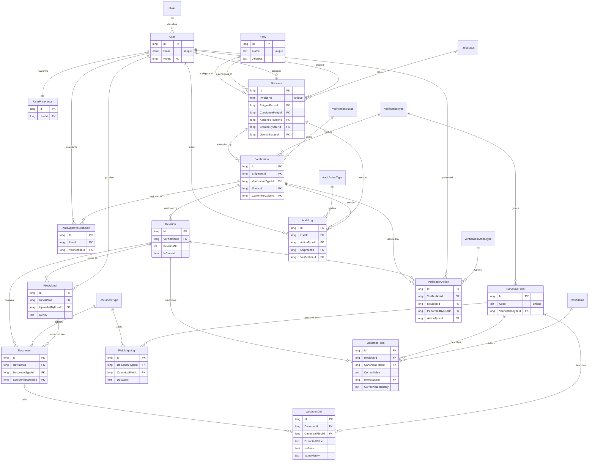

# Shipping Documents Validation — Database Design

Target platform: **OutSystems 11** (entities run on the platform DB / external SQL Server).
Files live in **AWS S3**; the database stores only S3 keys/URLs, never the binary.

---

## 1. Feature walkthrough (what the app actually does)

I read the running app's source (`src/App.tsx`, `src/data/mockData.ts`, `src/utils/comparison.ts`,
`src/utils/exportExcel.ts`, `src/utils/fileStorage.ts`, the `components/*`) to ground the model in
real behaviour rather than the feature bullet list. Key findings:

| # | Feature | What the code shows | DB impact |
|---|---------|---------------------|-----------|
| 1 | **Authentication** | Login by email; Microsoft SSO (`jane.doe@pttgcgroup.com`) and a username/password fallback. `admin.admin@…` is an admin. Per-user prefs: `autoApprove`, `onlyMyTasks`, and a per-user *excluded set* snapshot. | `User`, `Role`, `UserPreference`, `AutoApproveExclusion` |
| 2 | **File upload** | User uploads `CustomsFormality_<CIno>_<yyyymmdd>.pdf`; revisions are uploaded later per verification tab; insurance / draft-B/L are *paired* uploads (`insurance:detail`+`insurance:draft`, etc.). File saved to storage, AI extracts fields. Filename encodes the revision number. | `FileUpload`, `Revision` |
| 3 | **File export** | `exportVerificationTab` builds an Excel of one verification tab's comparison matrix. | logged in `AuditLog` |
| 4 | **Display validation result** | Per task there are **4 verification types**: `customFormality`, `insurance`, `draftBL`, `blDate`. Each builds a matrix: **canonical fields (rows) × documents (columns)**, each cell = extracted value + match/mismatch, plus a per-field *correct value*. (`buildComparisonRows`) | `Verification`, `Document`, `ValidationField`, `ValidationCell` |
| 5 | **Versioning** | **Two layers.** (a) *Document layer*: each verification keeps numbered revisions (`revisionStates` count/date/receiveDate + `revisionHistory` snapshot) and the user can switch/recall between them. (b) *Cell layer*: `fieldEditHistory[editKey] = [{value, timestamp}, …]` — a history per edited cell. | `Revision` (layer 1) + delimited history columns (layer 2) |
| 6 | **Edit validation result** | User edits a field's correct value, flips a row/cell match status (`fieldStatusOverrides`, `cellStatusOverrides`), and Approves/Rejects with `reason`+`remark`. Manually edited cells are flagged. | `ValidationField`, `ValidationCell`, `VerificationAction` |
| 7 | **Tasks display page** | Searchable/filterable list, assignment to a user, status per tab, date filtering, pagination. | `Shipment` + `Verification` |
| 8 | **User logging / audit trail** | Login/logout, file upload, file export are time-stamped per user; approve/reject/verified carry actor + reason + remark and are kept per revision. | `AuditLog`, `VerificationAction` |

*Out of scope (confirmed):* the **LLM-Compare** page (`LlmComparePage`, `services/llm-compare.ts`, the
`prompt*.json` files) is an internal QA tool for comparing model extraction outputs. It is not part of
the operational validation flow and is **deliberately excluded** from this database design.

---

## 2. Design principles applied

1. **No composite primary keys.** Every table has a single surrogate `Id` (OutSystems auto-number,
   Long Integer). Where a natural composite uniqueness exists (e.g. "one verification per type per
   shipment"), it is enforced with a **unique index** on the FK columns — *not* a composite PK.
   This is also the only option OutSystems gives you (see §7).
2. **Single-column foreign keys only.** Every relationship is one Entity-reference attribute.
3. **Every relationship has a stated reason** (§5).
4. **Reference/enumerated values are Static Entities** (status, types) so the FK is an integer, not a
   repeated string — this is the main driver of 3NF here.
5. **Files in S3.** The DB holds `S3Bucket` + `S3Key` text only (OutSystems advises against large
   binary in the DB).

---

## 3. Entity catalogue

### 3.1 Static / reference entities (enumerations & lookup data)

| Entity | Members / purpose |
|--------|-------------------|
| **Role** | `Reviewer`, `Admin` |
| **TaskStatus** | `Pending`, `Attention`, `Match`, `Approved`, `Rejected` |
| **VerificationStatus** | `Pending Verification`, `Attention`, `Rejected`, `Match`, `Match with condition`, `Approved`, `Incomplete` |
| **VerificationType** | `customFormality`, `insurance`, `draftBL`, `blDate` |
| **DocumentType** | `Shipping Advice`, `Custom Invoice`, `Packing List`, `Letter of Credit`, `Shipping Instruction`, `DocXPort`, `Draft Insurance`, `Detail for Insurance Purpose`, `Draft B/L`, `Shipping Particular`, `Original B/L` |
| **RowStatus** | `match`, `mismatch`, `match-with-condition` |
| **VerificationActionType** | `verified`, `approve`, `reject` |
| **AuditActionType** | `Login`, `Logout`, `FileUpload`, `FileExport`, `Assign`, `Approve`, `Reject`, `RevisionSwitch` |

### 3.2 Reference data (regular entities, edited rarely)

**CanonicalField** — the ~40 fixed business fields being validated (`ALL_CANONICAL`).

| Attr | Type | Key | Notes |
|------|------|-----|-------|
| Id | Long Integer | **PK** | |
| Code | Text(100) | | e.g. `INVOICE NO.`, `AMOUNT INSURED HEREUNDER` — unique index |
| VerificationTypeId | Long Integer | **FK → VerificationType** | which tab the field belongs to |
| DisplayOrder | Integer | | column/row ordering |

**FieldMapping** — per-document-type label for a canonical field (replaces the `fieldMapping`
dictionaries duplicated in every mock task).

| Attr | Type | Key | Notes |
|------|------|-----|-------|
| Id | Long Integer | **PK** | |
| DocumentTypeId | Long Integer | **FK → DocumentType** | |
| CanonicalFieldId | Long Integer | **FK → CanonicalField** | |
| DocLabel | Text(200) | | e.g. CI's "REFERENCE NO." for canonical "REF NO." |
| | | | *unique index (DocumentTypeId, CanonicalFieldId)* |

### 3.3 Identity & preferences

**User**

| Attr | Type | Key | Notes |
|------|------|-----|-------|
| Id | Long Integer | **PK** | |
| Email | Email(255) | | login identity — **unique index** |
| DisplayName | Text(150) | | |
| RoleId | Long Integer | **FK → Role** | |
| IsActive | Boolean | | |
| CreatedOn | DateTime | | |

**UserPreference** (1‑to‑1 with User — keeps volatile UI flags out of `User`)

| Attr | Type | Key | Notes |
|------|------|-----|-------|
| Id | Long Integer | **PK** | |
| UserId | Long Integer | **FK → User** | unique index → enforces 1:1 |
| AutoApprove | Boolean | | |
| OnlyMyTasks | Boolean | | |

**AutoApproveExclusion** — the per-user snapshot of verifications that must *not* be auto-approved
(tasks already `Match` when the toggle was switched on).

| Attr | Type | Key | Notes |
|------|------|-----|-------|
| Id | Long Integer | **PK** | |
| UserId | Long Integer | **FK → User** | |
| VerificationId | Long Integer | **FK → Verification** | *unique index (UserId, VerificationId)* |

### 3.4 Business / shipment core

**Party** — companies (shipper & consignees). Removes the repeating consignee name+address
(`SI_ADDR` / "ORIGINAL SHIPPING DOCUMENTS AND COPY") from every shipment → 3NF.

| Attr | Type | Key | Notes |
|------|------|-----|-------|
| Id | Long Integer | **PK** | |
| Name | Text(200) | | unique index |
| Address | Text(2000) | | full block incl. contact line |

**Shipment** (the "Task" — one Customs Invoice)

| Attr | Type | Key | Notes |
|------|------|-----|-------|
| Id | Long Integer | **PK** | |
| InvoiceNo | Text(50) | | CI number — **unique index** |
| ShipmentRef | Text(50) | | `SHP-2026-001` |
| ShipperPartyId | Long Integer | **FK → Party** | the exporter (PTT GC) |
| ConsigneePartyId | Long Integer | **FK → Party** | the buyer |
| AssignedToUserId | Long Integer | **FK → User** | reviewer responsible |
| CreatedByUserId | Long Integer | **FK → User** | who uploaded the CF |
| OverallStatusId | Long Integer | **FK → TaskStatus** | derived (`deriveOverallStatus`), stored for list filtering |
| SubmittedDate | DateTime | | |
| LastUpdatedOn | DateTime | | |

### 3.5 Verification & versioning

**Verification** — one row per (Shipment × VerificationType).

| Attr | Type | Key | Notes |
|------|------|-----|-------|
| Id | Long Integer | **PK** | |
| ShipmentId | Long Integer | **FK → Shipment** | |
| VerificationTypeId | Long Integer | **FK → VerificationType** | |
| StatusId | Long Integer | **FK → VerificationStatus** | |
| CurrentRevisionId | Long Integer | **FK → Revision** (nullable) | the active/recalled revision |
| LastUpdatedOn | DateTime | | |
| | | | *unique index (ShipmentId, VerificationTypeId)* → max one per tab |

**Revision** — *Layer‑1 versioning (document layer).* Each re-upload = a new numbered revision.

| Attr | Type | Key | Notes |
|------|------|-----|-------|
| Id | Long Integer | **PK** | |
| VerificationId | Long Integer | **FK → Verification** | |
| RevisionNo | Integer | | 0,1,2… per verification |
| RevisionDate | DateTime | | |
| ReceiveDate | Date | | CF receive date |
| IsCurrent | Boolean | | switch/recall sets this |
| | | | *unique index (VerificationId, RevisionNo)* |

**FileUpload** — the actual PDF(s) of a revision in S3.

| Attr | Type | Key | Notes |
|------|------|-----|-------|
| Id | Long Integer | **PK** | |
| RevisionId | Long Integer | **FK → Revision** | |
| DocumentRole | Text(40) | | `main`, `insurance:detail`, `insurance:draft`, `draftBL:shipping`, `draftBL:draft` |
| FileName | Text(255) | | original filename (encodes rev no.) |
| S3Bucket | Text(100) | | |
| S3Key | Text(500) | | object key — **no binary in DB** |
| UploadedByUserId | Long Integer | **FK → User** | |
| UploadedOn | DateTime | | |

**Document** — one extracted shipping document inside a revision.

| Attr | Type | Key | Notes |
|------|------|-----|-------|
| Id | Long Integer | **PK** | |
| RevisionId | Long Integer | **FK → Revision** | |
| DocumentTypeId | Long Integer | **FK → DocumentType** | |
| SourceFileUploadId | Long Integer | **FK → FileUpload** (nullable) | which PDF it came from |

> `DocXPort` is a *virtual* document the UI synthesises from edited correct values; it is not stored
> as a `Document`. The correct value lives on `ValidationField`.

### 3.6 Validation result (the matrix) + Layer‑2 cell versioning

**ValidationField** — one row per canonical field per revision = the "correct value" row header.

| Attr | Type | Key | Notes |
|------|------|-----|-------|
| Id | Long Integer | **PK** | |
| RevisionId | Long Integer | **FK → Revision** | |
| CanonicalFieldId | Long Integer | **FK → CanonicalField** | |
| CorrectValue | Text(2000) | | current correct value |
| RowStatusId | Long Integer | **FK → RowStatus** | match / mismatch / match-with-condition |
| IsManuallyEdited | Boolean | | from `manuallyEditedCells` |
| **CorrectValueHistory** | Text(>2000 → nvarchar(max)) | | *Layer‑2:* `\|`-delimited prior values |
| **CorrectValueHistoryTs** | Text(>2000 → nvarchar(max)) | | parallel `\|`-delimited ISO timestamps (same index positions) |
| | | | *unique index (RevisionId, CanonicalFieldId)* |

**ValidationCell** — one extracted cell = (document × canonical field).

| Attr | Type | Key | Notes |
|------|------|-----|-------|
| Id | Long Integer | **PK** | |
| DocumentId | Long Integer | **FK → Document** | revision reachable via Document → no redundant FK |
| CanonicalFieldId | Long Integer | **FK → CanonicalField** | |
| ExtractedValue | Text(2000) | | AI-extracted value |
| IsApplicable | Boolean | | doc lacks this field → N/A |
| IsMatch | Boolean | | from `cellStatusOverrides` / computed |
| **ValueHistory** | Text(nvarchar(max)) | | *Layer‑2:* `\|`-delimited edit history |
| | | | *unique index (DocumentId, CanonicalFieldId)* |

### 3.7 Audit & actions

**VerificationAction** — approve / reject / verified, kept per revision (so a recalled revision shows
its own decision), with actor + reason + remark.

| Attr | Type | Key | Notes |
|------|------|-----|-------|
| Id | Long Integer | **PK** | |
| VerificationId | Long Integer | **FK → Verification** | |
| RevisionId | Long Integer | **FK → Revision** | action applies to this version |
| ActionTypeId | Long Integer | **FK → VerificationActionType** | |
| PerformedByUserId | Long Integer | **FK → User** | |
| Reason | Text(500) | | |
| Remark | Text(2000) | | |
| PerformedOn | DateTime | | |

**AuditLog** — system-wide trail (login/logout, upload, export, assign…).

| Attr | Type | Key | Notes |
|------|------|-----|-------|
| Id | Long Integer | **PK** | |
| UserId | Long Integer | **FK → User** | |
| ActionTypeId | Long Integer | **FK → AuditActionType** | |
| ShipmentId | Long Integer | **FK → Shipment** (nullable) | context when relevant |
| VerificationId | Long Integer | **FK → Verification** (nullable) | context when relevant |
| Detail | Text(500) | | free text (filename, IP, etc.) |
| OccurredOn | DateTime | | |

---

## 4. ER diagram

---

## 5. Relationship rationale (every FK justified)

| Relationship | Card. | Why it exists / why this direction |
|--------------|-------|------------------------------------|
| Role → User | 1:N | A user has exactly one role; a role applies to many users. Lets admin checks be a join, not a hard-coded email. |
| User → UserPreference | 1:1 | Prefs (`autoApprove`,`onlyMyTasks`) belong to one user; isolating them keeps the hot `User` row small. Unique index on `UserId` enforces 1:1. |
| User / Verification → AutoApproveExclusion | M:N | A snapshot is "this user will not auto-approve this verification". Resolved with a junction (surrogate PK + unique index), never a composite key. |
| Party → Shipment (shipper) | 1:N | One exporter ships many shipments; storing the company once removes duplicated name/address. |
| Party → Shipment (consignee) | 1:N | Same, for the buyer. Two separate FKs because a shipment has exactly one of each role. |
| User → Shipment (assigned) | 1:N | Task list filters by reviewer (`onlyMyTasks`); one reviewer owns a shipment at a time. |
| User → Shipment (created) | 1:N | Audit/ownership of the original upload, distinct from the assignee. |
| TaskStatus → Shipment | 1:N | Derived overall status stored for fast list filtering; FK to a static entity avoids a free-text status. |
| Shipment → Verification | 1:N (≤4) | A shipment is validated across the four verification tabs; each is an independent unit of work/status. Unique index `(ShipmentId,VerificationTypeId)` caps it at one per tab. |
| VerificationType → Verification | 1:N | Identifies which tab; static FK. |
| VerificationStatus → Verification | 1:N | Per-tab status (`Match`, `Approved`…). |
| Verification → Revision | 1:N | **Layer‑1 versioning.** Each re-upload is a new revision the user can switch/recall between. |
| Verification → Revision (CurrentRevisionId) | N:1 | A pointer to the active/recalled revision (the "switch/recall" feature). |
| Revision → FileUpload | 1:N | A revision may carry a *pair* of PDFs (insurance/draft-B/L). |
| User → FileUpload | 1:N | Who uploaded each file — required for the audit trail. |
| Revision → Document | 1:N | A revision contains several extracted shipping documents (the matrix columns). |
| DocumentType → Document | 1:N | Document kind; static FK drives `getDocsForVerification` grouping. |
| FileUpload → Document | 1:N | Traces an extracted document back to its source PDF (one PDF → many logical docs possible). |
| VerificationType → CanonicalField | 1:N | Each field belongs to one tab's field set. |
| DocumentType + CanonicalField → FieldMapping | M:N | The doc-specific label for a canonical field is reference data shared by all shipments — pulled out of every task. Junction with surrogate PK + unique index. |
| Revision → ValidationField | 1:N | The correct-value rows of the matrix, snapshotted per revision. |
| CanonicalField → ValidationField | 1:N | Which business field the row is. |
| RowStatus → ValidationField | 1:N | Row match state (incl. `match-with-condition`). |
| Document → ValidationCell | 1:N | The cells under a document column. Revision is reached via Document, so no redundant Revision FK on the cell (avoids an update anomaly). |
| CanonicalField → ValidationCell | 1:N | Which field the cell is for. |
| Verification → VerificationAction | 1:N | Approve/reject/verified history. |
| Revision → VerificationAction | 1:N | The decision is tied to the *version* it was made on, so a recalled revision shows its own decision. |
| User → VerificationAction | 1:N | The actor (`by`). |
| VerificationActionType → VerificationAction | 1:N | verified/approve/reject; static FK. |
| User → AuditLog | 1:N | The trail's actor. |
| AuditActionType → AuditLog | 1:N | Login/logout/upload/export… static FK. |
| Shipment / Verification → AuditLog | 1:N (nullable) | Optional context for an event (a login has none; an export has both). |

---

## 6. Two-layer versioning — how the NOTE is implemented

The requirement: **layer 1 = document/upload version**, **layer 2 = cell-level version using a
delimiter + indexing**, in *one* validation area.

> **Decision (confirmed):** Layer‑2 uses the **delimiter approach** below. The normalized
> `CellVersion` fallback in the caveat is documented only as a future option, not the active design.

* **Layer 1 (document layer) → `Revision` rows.** A separate row per version, addressed by
  `RevisionNo` and pointed at by `Verification.CurrentRevisionId`. Switching/recalling is just moving
  that pointer and flipping `IsCurrent`. Full per-revision snapshots of the matrix live in
  `ValidationField` / `ValidationCell` (matching the app's `revisionHistory` snapshot behaviour).

* **Layer 2 (cell layer) → delimited history columns.** Instead of a row per cell-edit (which would
  explode row counts), each cell keeps its history inline:
  * `ValidationField.CorrectValueHistory` / `ValidationCell.ValueHistory` = `"v0|v1|v2"`.
  * `ValidationField.CorrectValueHistoryTs` = `"2026-03-01T..|2026-03-02T.."`, **index-aligned** so
    position *i* of the value string pairs with position *i* of the timestamp string — this rebuilds
    the app's `fieldEditHistory: [{value, timestamp}]` exactly.
  * Length: set the attribute length **> 2000** so OutSystems maps it to `nvarchar(max)`; these
    columns are therefore **not indexed** (you never search inside them — you load them with the row).

> ⚠️ **Honest caveat (it affects §7's normalization claim):** the delimited-history columns are a
> deliberate denormalization. A `"v0|v1"` column is a repeating group, which **breaks strict 1NF**.
> The fully-normalized alternative is a `CellVersion(Id PK, ValidationFieldId FK, VersionIndex,
> Value, EditedOn, EditedByUserId)` table — clean 3NF, queryable, and still no composite key. I
> recommend that table **if** you ever need to query/diff individual historic cell values; keep the
> delimiter design if cell history is only ever read back wholesale with its row (lower row count,
> fewer joins, simpler reads — which is what the current UI does). The rest of the schema (§3) stays
> identical either way.

**Required guard rails for the delimiter approach:** pick a delimiter guaranteed absent from the data.
`|` appears in some addresses/clauses, so prefer a non-printing sentinel such as the Unit Separator
`U+001F` (or `¦`). Always escape or reject the delimiter on write so indices never shift.

---

## 7. Normalization

**1NF — atomic columns, no repeating groups.**
The source app stores `correctValues` as a dictionary and `documents` as nested arrays inside one
task object. The design splits these into one row per field (`ValidationField`) and one row per cell
(`ValidationCell`); `fieldMapping` dictionaries become `FieldMapping` rows. ✅ — *except* the two
opt-in delimited-history columns (§6), which are a conscious exception with a 3NF fallback offered.

**2NF — no partial dependency on part of a key.**
Because **every table uses a single-column surrogate `Id`** (rule #1), there is no partial key to
depend on — 2NF is satisfied by construction. The natural composite uniqueness
(`ShipmentId+VerificationTypeId`, `RevisionId+CanonicalFieldId`, `DocumentTypeId+CanonicalFieldId`,
`UserId+VerificationId`) is enforced by **unique indexes**, so we get the integrity of a composite
key without the composite key.

**3NF — no transitive dependency (non-key → non-key).**
Removed transitive dependencies:
| Was transitively dependent | Now lives in | Determinant |
|---|---|---|
| consignee address (`SI_ADDR`) on a shipment | `Party.Address` | consignee, not shipment |
| doc-specific field label (`fieldMapping`) on every task | `FieldMapping.DocLabel` | (DocumentType, CanonicalField) |
| status / type display strings | Static entities | the status code |
| reviewer name/email repeated per shipment | `User` | the user Id |

All non-key attributes now depend on the key, the whole key, and nothing but the key (BCNF holds too,
since every determinant is a candidate key — the `Id` or the unique-indexed FK set).

---

## 8. OutSystems validity check

| Platform rule | Design compliance |
|---|---|
| **One identifier per Entity; no composite PK** ([Database Constraints](https://success.outsystems.com/Documentation/11/Reference/OutSystems_Language/Data/Database_Reference/Database_Constraints)) | ✅ Every entity has a single auto-number `Id`. All composite uniqueness is done with **unique indexes** (the platform's documented substitute). |
| **Auto-number: one sequential attribute per entity** ([Auto Numbers](https://success.outsystems.com/documentation/11/reference/outsystems_language/data/database_reference/auto_numbers_on_database/)) | ✅ Only `Id` is sequential. |
| **Foreign keys are single Entity-reference attributes** | ✅ No multi-column FKs. |
| **Text > 2000 → `nvarchar(max)`; long text can't be indexed** ([forum ref](https://www.outsystems.com/forums/discussion/59568/any-limitation-in-the-length-of-text-data-type/)) | ✅ History columns are long `nvarchar(max)` and intentionally **unindexed**; all indexed text (`Email`, `InvoiceNo`, `Code`) is short. |
| **Avoid large binary in the DB** | ✅ PDFs in **S3**; DB stores `S3Bucket`+`S3Key` only. |
| **Enumerations as Static Entities** | ✅ 8 static entities (§3.1). |
| **Delete rules (Protect/Delete/Ignore)** | Suggested: `Shipment→Verification→Revision→{Document,ValidationField}` = **Delete** (cascade a removed shipment, mirroring `handleRemoveTask`); all `User` FKs = **Protect** (never delete a user referenced by an audit trail); static-entity FKs = **Protect**. |

**Verdict:** the design is valid on OutSystems 11 — it relies only on single auto-number identifiers
and unique indexes, exactly the platform's prescribed pattern for "I need a composite key but can't
have one."

---

### Sources
- [Entities — OutSystems 11 Documentation](https://success.outsystems.com/Documentation/11/Developing_an_Application/Use_Data/Data_Modeling/Entities/)
- [Database Constraints — OutSystems 11](https://success.outsystems.com/Documentation/11/Reference/OutSystems_Language/Data/Database_Reference/Database_Constraints)
- [Auto Numbers on Database — OutSystems 11](https://success.outsystems.com/documentation/11/reference/outsystems_language/data/database_reference/auto_numbers_on_database/)
- [Text data type length limits — OutSystems forum](https://www.outsystems.com/forums/discussion/59568/any-limitation-in-the-length-of-text-data-type/)
